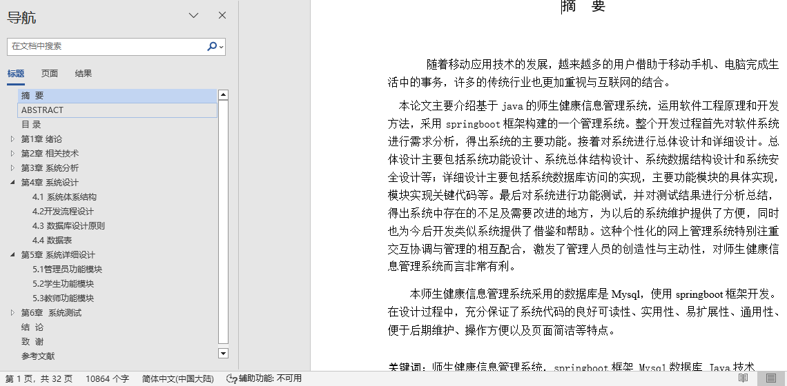
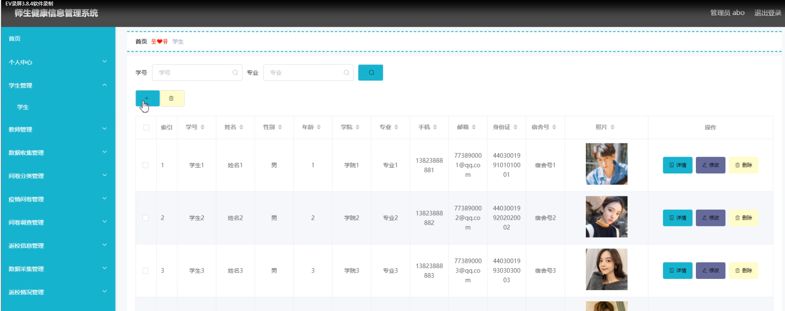
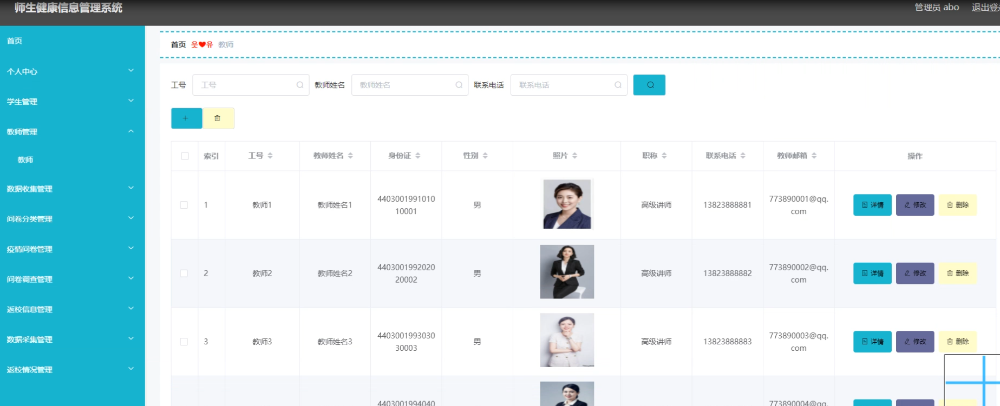
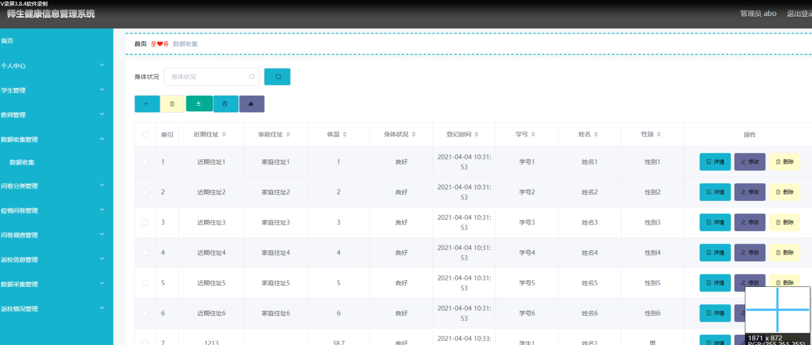
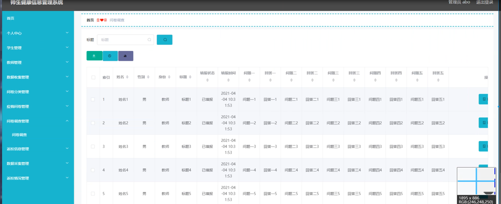
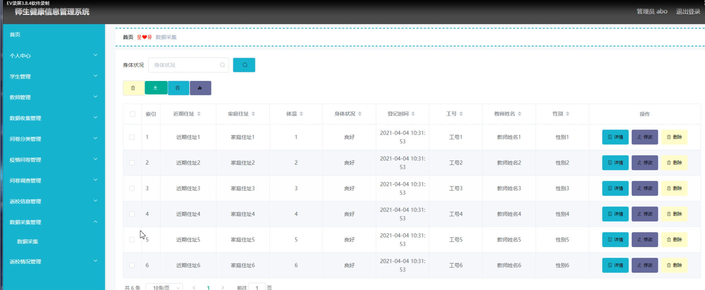
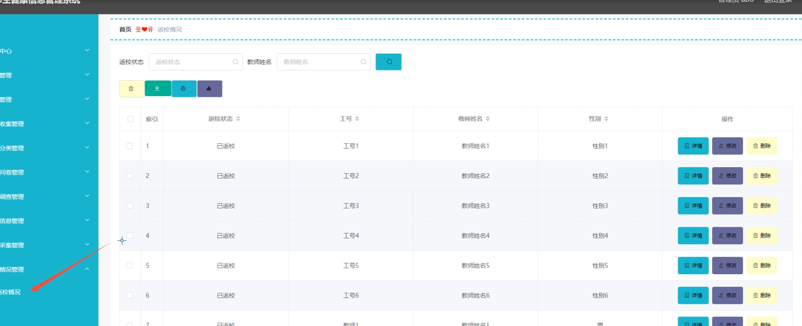
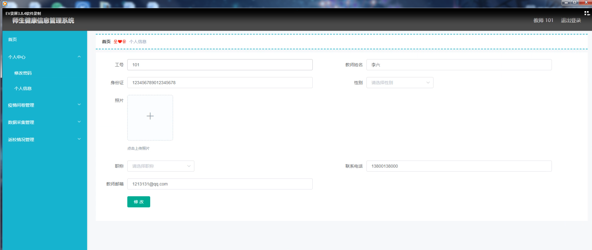
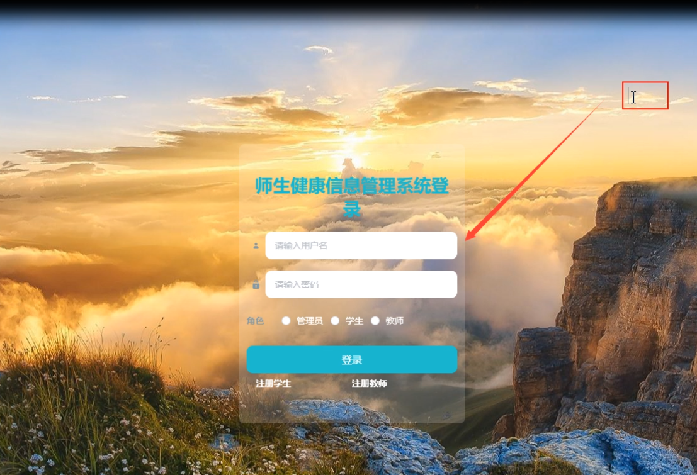

## 师生健康信息管理系统(程序+报告)

- <b>完整代码获取地址：从戎源码网 ([https://armycodes.com/](https://armycodes.com/))</b>
- <b>技术探讨、资料分享，请加QQ群：692619798</b> 
- <b>作者微信：19941326836  QQ：952045282</b> 
- <b>承接计算机毕业设计、Java毕业设计、Python毕业设计、深度学习、机器学习</b>
- <b>选题+开题报告+任务书+程序定制+安装调试+论文+答辩ppt 一条龙服务</b>
- <b>所有选题地址 ([https://github.com/YuLin-Coder/AllProjectCatalog](https://github.com/YuLin-Coder/AllProjectCatalog)) </b>

## 项目介绍
师生健康信息管理系统，系统包含两种角色：用户、管理员，系统分为前台和后台两大模块，主要功能如下：

1 管理员功能模块
管理员通过填写注册时输入的用户名、密码、角色进行登录。登录后，可以访问和操作以下功能模块：

- 个人中心: 查看和编辑个人信息。
- 学生管理: 查看、添加、修改和删除学生信息，包括学号、姓名、性别、学院、专业、联系方式等。
- 教师管理: 查看、添加、修改和删除教师信息，包括工号、姓名、身份证、职称、联系方式等。
- 数据收集管理: 管理数据收集信息，包括住址、体温、身体状况等。
- 问卷分类管理: 管理问卷的分类。
- 疫情问卷管理: 管理疫情相关问卷，包括新增、查看详情、修改和删除问卷。
- 问卷调查管理: 管理问卷调查信息，包括查看、修改和删除填报信息。
- 返校信息管理: 管理返校信息，包括查看详情、下载和查看统计报表。
- 数据采集管理: 管理数据采集信息，包括查看详情、修改和删除操作。
- 返校情况管理: 管理返校情况信息，包括查看详情、修改和删除操作。

2 学生功能模块
学生登录系统后，可以访问以下功能模块：

- 个人中心: 查看和编辑个人信息。
- 数据收集管理: 管理个人的数据收集信息，包括住址、体温、身体状况等。
- 疫情问卷管理: 管理并回答疫情相关问卷，包括查看、回答和搜索问卷。
- 返校信息管理: 管理返校信息，包括查看详情、添加、修改和删除操作。

3 教师功能模块
教师登录系统后，可以访问以下功能模块：

- 个人中心: 查看和编辑个人信息，包括工号、身份证、职称、邮箱等。
- 疫情问卷管理: 管理并回答疫情相关问卷，包括新增、查看详情和在线回答操作。
- 问卷调查管理: 查看和管理问卷调查信息，包括查看、修改和删除填报信息。
- 数据采集管理: 查看数据采集信息，包括住址、体温、身体状况等。
- 返校情况管理: 管理返校情况信息，包括查看详情、修改和删除操作。

## 项目技术
- 编程语言：Java
- 数据库：MySQL
- 项目管理工具：Maven
- 前端技术：HTML、CSS、JavaScript、Vue
- 后端技术：Spring、SpringMVC、MyBatis

## 运行环境
- JDK版本：JDK1.8及以上
- 开发工具：IDEA、Ecplise、Myecplise都可以
- 数据库: MySQL5.7及以上
- Maven：maven3.0及以上
- Node：14.14.0及以上

## 运行截图

